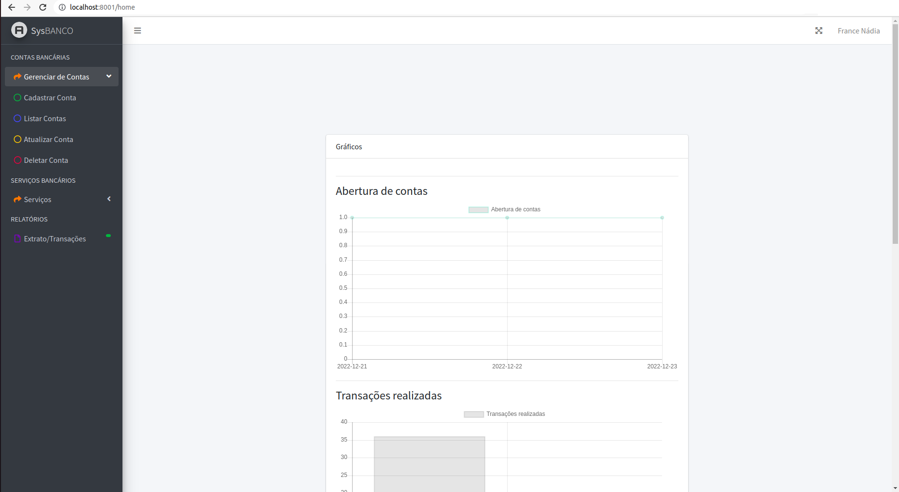
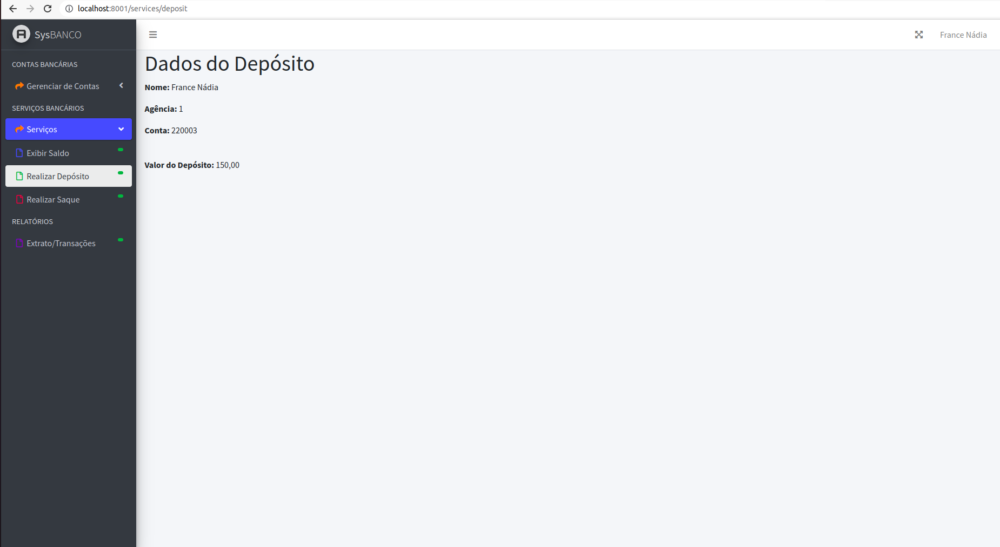

# **Bank-account-system**

Projeto Laravel, com banco de dados MySQL, que consiste num Sitema de Conta Bancária composo por um CRUD de cadastro para abertura de conta. <br/>
Foram utilizadas algumas validações nos input de dados como CPF e email. Além disso, foi usada uma função para geração de número de conta automático. 

O sistema conta com funcionalidades como Exibir saldo, Depósito, Saque e Relatório de transações ocorridas com seleção de período (Extrato).
<br/>
No dashboard contém alguns gráficos para exibir informações sobre a conta.

## Instalação
Inicialmente é necessário ter o **PHP >= 7.4** instalado, juntamente com o **Composer**.
Em seguida, dentro da pasta do projeto no terminal, execute:
```
composer install
```
## Uso
Configure os dados do banco no arquivo ``.env`` com as informações do banco de dados que você tiver criado no seu ambiente local.<br/> O ``.env.example`` serve como exemplo:
```
DB_DRIVER=mysql
DB_HOST=localhost
DB_PORT=3306
DB_DATABASE=name_database
DB_USERNAME=user_database
DB_PASSWORD=password_database
```

## Execução
No terminal, dentro da pasta do projeto execute:
```
php artisan key:generate
php artisan migrate
php artisan db:seed
php artisan serve
```

**Usuário e senha de acesso**
Após subir o servidor, aparecerá o endereço de acesso parecido com ``http://127.0.0.1:8000``. Ao abri-lo no navegador, cadastre o usuário e a senha para acessar.
<br/> Exemplo:

```
usuário: test@email.com
senha: password1234
```

### **Bank-account-system**
##### **Template AdimLTE 3**



